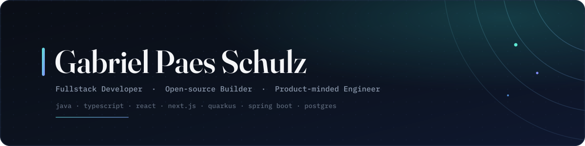

<p align="center">
  
</p>

<p align="center">
  <a href="https://linkedin.com/in/gabrielpaesschulz">
    
  </a>
  <a href="mailto:gabriel_paes@live.com">
    
  </a>
</p>

---

I build backend systems that don't fall apart, frontend interfaces that don't feel like an afterthought, and developer tools that remove the boring glue between good libraries.

**4+ years** modernizing corporate systems — legacy migrations, financial workflows, REST integrations, query optimization, internal tools and production support. Off the clock, I ship my own products and open-source tooling, usually around one theme: turning repetitive engineering pain into something cleaner, typed and reusable.

> I care about **code that communicates intent**, **architecture that survives its own growth**, and **products that feel like someone actually thought about the person using them**.

<br/>

## ✦ Selected Work

### `FilterBridge` — schema-first filters for React admin screens

<a href="https://www.npmjs.com/package/@filterbridge/core"></a>
<a href="https://filterbridge-demo.vercel.app"></a>
<a href="https://github.com/gabpaesschulz/filterbridge/releases/tag/v0.1.0"></a>

Admin dashboards repeat the same filter logic across React state, URL params, backend DTOs and table filters. **Declare it once** — reuse the typed schema everywhere.

```ts
const filters = defineFilters({
  search: text(),
  status: select(["draft", "pending", "paid", "failed"]),
  tags:   multiSelect(["urgent", "recurring", "manual-review"]),
})

const dto    = toQueryDto(filters, state)     // → backend
const params = toSearchParams(filters, state) // → URL
```

Shipped as a pnpm monorepo of **5 packages** (`core` · `react` · `browser` · `tanstack` · `next`), with ESM/CJS output, type declarations, Vitest smoke tests and a live demo.

<br/>

### `hookform-action` — the missing layer between React Hook Form and your server

<a href="https://www.npmjs.com/package/hookform-action-core"></a>
<a href="https://hookform-action-docs.vercel.app/"></a>

Every project re-writes the same wiring to connect a form to a server action: `useTransition`, FormData serialization, Zod error mapping, `setError()` calls, pending state. I abstracted it away.

```ts
const { register, handleSubmit, formState } =
  useActionForm(loginAction, { validationMode: "onChange" })
```

Full TypeScript inference, optimistic UI with rollback, multi-step wizard persistence, a floating DevTools panel and automated tests.

```bash
npm i hookform-action-core
```

<br/>

### `Aprovado.ai` — PDF → Anki flashcards in under 60s, powered by LLMs

<a href="https://aprovadoai-1ol7.vercel.app"></a>

Built end-to-end: Next.js + TypeScript, LLM API integration, freemium model with three tiers, payment gateway (card · PIX · boleto) and CI/CD on Vercel.

> Not a tutorial clone. Not just a landing page. A real product with pricing, payment flow and usage intent.

<br/>

## ✦ Also in the Lab

| | Project | What it is |
|---|---|---|
| 🪦 | [**Graveyard**](https://github.com/gabpaesschulz/graveyard) | A digital memorial for abandoned projects — death certificates, epitaphs, a funeral wizard. Next.js 15 · Prisma · Postgres · Framer Motion. *"The projects that didn't work taught me more than the ones that did."* |
| 💰 | [**FreedomCalc**](https://github.com/gabpaesschulz/freedomcalc) | Local-first FIRE & compound-interest planner. Zero servers, AES-256 in localStorage, PIN lock, PWA-ready. |
| 🎬 | [**Watch Planner**](https://github.com/gabpaesschulz/letterbox-scrapper) | Turns any Letterboxd list into a personalized watch schedule. TMDB enrichment · drag-and-drop calendar · `.ics` export. |
| 🎤 | [**Setlist**](https://github.com/gabpaesschulz/setlist) | Concert & festival lifecycle planner with budget guardrails and predictive alerts. IndexedDB-first, offline-capable. |

<br/>

## ✦ Stack

**Backend**&nbsp;&nbsp;


**Frontend**&nbsp;&nbsp;


**Data**&nbsp;&nbsp;


**Craft & DevOps**&nbsp;&nbsp;


&nbsp;·&nbsp; TDD · SOLID · Clean Code · Hexagonal Architecture

<br/>

## ✦ GitHub

<p align="center">
  
  
</p>

<br/>

<p align="center"><em>"Persistence beats intensity when consistency stays in the game."</em></p>
